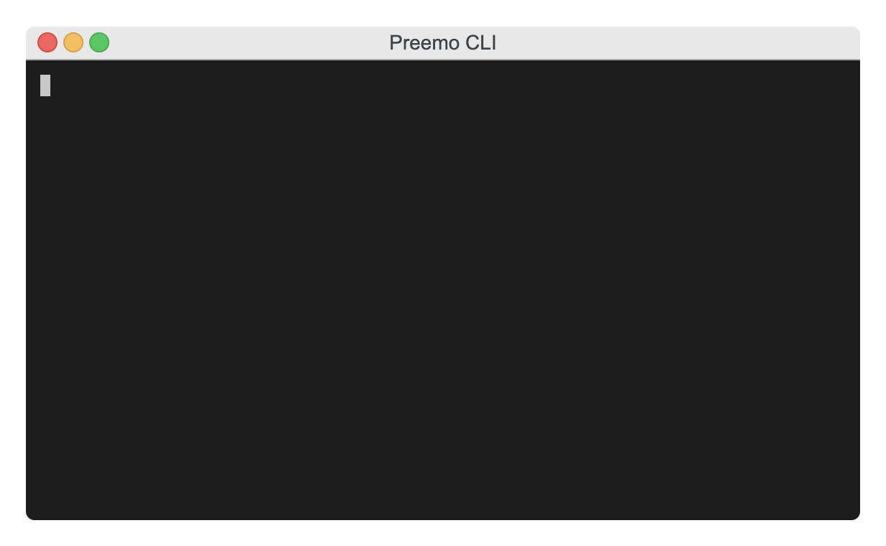

# gradient-sdk-python-example

Quick example of how to use Gradient API with Python.

## Setup

The code relies on environment variables. They can be injected through `dotenv` by creating `.env` file in the current directory:

```
GRADIENT_ACCESS_TOKEN=...
GRADIENT_WORKSPACE_ID=...
```

## Usage

1. Clone this repo
2. Run `poetry install`
3. Run `poetry run fine_tune` to run fine-tuning example, or `poetry run embeddings` to run embeddings example

## Example


